<div align="center">
  
</div>

###  Python Developer • Backend Engineer • API Builder

<p align="center">
  
</p>

---

## About Me

```python
class MudasirAhmed:
    name = "Mudasir Ahmed"
    role = "Python Backend Developer"

    skills = [
        "Python",
        "Flask",
        "FastAPI",
        "REST APIs",
        "Backend Development"
    ]
<div align="center">
  
</div>
